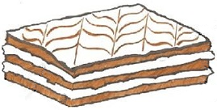
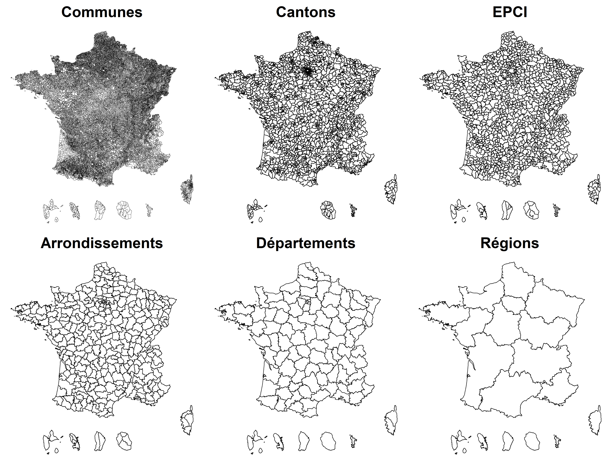
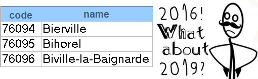

```{r setup, include=FALSE}
options(htmltools.dir.version = FALSE)
#knitr::opts_chunk$set(dev = "svg", cache = FALSE)
#remotes::install_github("mitchelloharawild/icons", force=TRUE)
#icons::download_fontawesome()
```


```{r wrap-hook, include=FALSE}
library(knitr)
hook_output = knit_hooks$get('output')
knit_hooks$set(output = function(x, options) {
  # this hook is used only when the linewidth option is not NULL
  if (!is.null(n <- options$linewidth)) {
    x = knitr:::split_lines(x)
    # any lines wider than n should be wrapped
    if (any(nchar(x) > n)) x = strwrap(x, width = n)
    x = paste(x, collapse = '\n')
  }
  hook_output(x, options)
})
```

.pull-left[
## Who am I?
]

.pull-right[
<center></center>
]

- Kim Antunez
    * *Now* : civil servant for the French National Institute of Statistics (Insee)
    
    * *Before* : Student at ENSAE
    
    * *Before again* : worked for the French Observatory of territories (USER of spatial datasets)


- **R packages** on how to deal with the change of administrative divisions over time, in the case of French territories. 

    * [`COGugaison`](https://antuki.github.io/COGugasion/)

    * [`CARTElette`](https://antuki.github.io/CARTElette/)

---

## Administrative divisions... 

.left-column[
</img>

]
.right-column[
<center>The French territorial « mille-feuille »</center></br>
<center></center>
]

---
## ... change over time
<center></center>


```{r include=FALSE}
library(readxl)
library(dplyr)

communes_vides <- c("26030", "26274", "31127", "54310", "55039", "55050", "55139", "55189", "55239", "55307", "55394", "57470", "65134")

recup_bdd <- function(annee) {
  bdd <- read_excel("data/pop-sexe-age-quinquennal6817.xls", 
    sheet = paste0("COM_", annee), skip = 13, col_names = TRUE, 
    na = "") %>%
    mutate(codgeo = paste0(substr(DR, 1, 2), CR)) %>%
    filter(!is.na(get(paste0("ageq_rec01s1rpop", annee)))) %>%
    mutate(total_s1 = rowSums(select(., contains("s1"))), 
    total_s2 = rowSums(select(., contains("s2")))) %>%
    filter( codgeo%in%communes_vides  | 
             (!codgeo%in%communes_vides & total_s1+total_s2!=0)
              ) %>% #bug certaines communes sont à 0 au lieu de NA
    select(codgeo, total_s1, total_s2) %>% 
    rename(code=codgeo,men=total_s1, women=total_s2)
  return(bdd)
}
library(COGugaison)
db <- recup_bdd(2017) %>% enlever_PLM 

#liste <- readRDS("data/couches.RDS")
#COM_sf <- liste[[1]]
#DEP_sf <- liste[[5]]
```

---

## ... change over time

The most annoying municipality of France!!!

```{r echo=FALSE}
trajectoire_commune("14099", 2016) #see also trajectoire_commune_shiny
```

---

## COGugaison

* **COG** = **O**fficial **G**eographical **C**ode (**OGC**)

an R package for manipulating french **spatial databases** produced at **different dates**

<center></center>


---
.pull-left[
### See modifications over the years
]

.pull-right[
 <center></center>
]

```{r include=FALSE}
trajectoire_commune("76108", 2014) #see also trajectoire_commune_shiny
evol <- modifications_communales(date_debut="01-01-2011",date_fin="01-01-2014")
cat(grep("(76095)|(76108)",strsplit(evol$fusions,"\n",fixed=TRUE)[[1]],value=TRUE))
cat(grep("(76095)|(76108)",strsplit(evol$defusions,"\n",fixed=TRUE)[[1]],value=TRUE))
```

`r icons::icon_style(icons::fontawesome("exclamation-triangle", style = "solid"), scale = 1, fill = "red")` All functions and parameters are translated from French for this presentation

```{r eval=FALSE}
municipality_evolution_graph(code = "76108", year = 2014) # uses {visNetwork}
```

<center></center>

```{r eval=FALSE}
evol <- municipalities_evolutions(begin_date="01-01-2011", end_date="01-01-2014")
```

```{r linewidth=90, eval=FALSE}
grep("(76095)|(76108)", evol$mergers, value = TRUE)
```

```{r linewidth=90, echo=FALSE}
cat("2012-01-01: Bois-Guillaume-Bihorel (76108) is a merger of Bihorel (76095), Bois-Guillaume (76108).")
```

```{r linewidth=90, eval=FALSE}
grep("(76095)|(76108)", evol$divisions, value = TRUE)
```

```{r linewidth=90, echo=FALSE}
cat("2014-01-01: Bois-Guillaume (76108) divided into Bois-Guillaume (76108), Bihorel
(76095).")
```

---

.pull-left[
### Guess the year of a database (1)
]

.pull-right[
<center></center>
]

```{r}
head(db, 2)
```

```{r eval=FALSE}
OGC_guess(db$code) # guesses the year of the Official Geographic Code (OGC)
```

```{r include=FALSE}
COG_akinator(db$code)
```

```{r echo=FALSE}
print("2019")
```

```{r eval=FALSE}
# creates a vector of ID of municipalities
codes <- c(db$code[-1],"75101",NA,"ZZZZZ","98756") 
merge_OGC(codes = codes, OGC = 2019)$not_in_db # ID not in the db
```

```{r echo=FALSE}
# creates a vector of ID of municipalities
codes <- c(db$code[-1],"75101",NA,"ZZZZZ","98756") 
cat(apparier_COG(vecteur_codgeo = codes,COG = 2019,donnees_insee = F)$absent_de_bdd) 
```

```{r eval=FALSE}
merge_OGC(codes = codes, OGC = 2019)$not_in_OGC # ID not in the OGC
```

```{r echo=FALSE}
cat(apparier_COG(vecteur_codgeo = codes,COG = 2019,donnees_insee = F)$absent_de_COG)
```
---

.pull-left[
### Guess the year of a database (2)
]

.pull-right[
<center></center>
]

*Author: Constance Lecomte (Observatoire des Territoires)*

```{r, include=FALSE}
diagnostic1 <- diag_COG(db)
```

```{r eval=FALSE}
diagnostic1 <- diag_OGC(db)
```

```
[1] "# Synthesis"
[1] "# OGC 2019"
[1] "# ------------------------------"
[1] "# Detailed diagnostic"
[1] "# The database contains 34953 municipality codes."
```

---

.pull-left[
### Guess the year of a database (3)
]

.pull-right[
<center></center>
]

```{r, include=FALSE}
db_modified <- db %>% add_row(code = c("75101",NA,"01091","98756","ZZZZZ"))
diagnostic2 <- diag_COG(db_modified, hypothese_COG = 2019)
```

```{r eval=FALSE}
db_modified <- db %>% add_row(code = c("75101",NA,"01091","98756","ZZZZZ"))
diagnostic2 <- diag_OGC(db_modified, hypothesis_OGC = 2019)

```

```
[1] "# unidentified OGC"
[1] "# ------------------------------"
[1] "# Detailed diagnostic"
[1] "# The database contains 34953 municipality codes."
|                         | Number of obs.|
|:------------------------|--------------:|
|2019                     |          34952|
|2018                     |              1|
|municipality districts   |              1|
|unknown codes            |              1|
|missing codes            |              1|
|overseas municipalities  |              1|
|unique codes             |          34957|
```

```{r, eval=FALSE}
diagnostic2[which(diagnostic2$diag_ogc!=2019),]
```

```{r, echo=FALSE}
diagnostic2[which(diagnostic2$diag_cog!=2019),] %>% 
  mutate(diag_cog= c("municipality district", "missing code", "2018", "overseas municipality", "unknown code"))
```

---

.pull-left[
### Guess the year of a database (4)
]

.pull-right[
<center></center>
]

An [online shiny interface](https://observatoire-des-territoires.shinyapps.io/diaCOG/) for `diag_OGC` :

<center></center>

---
.pull-left[
### Change the year of a db (1)
]

.pull-right[
 <center></center>

]

* **quantitative variable** [numeric]</br>
`r icons::icon_style(icons::fontawesome("hand-point-right", style = "solid"), scale = 1, fill = "#562457")` See `change_OGC_numeric` 

    + *mergers * `r icons::icon_style(icons::fontawesome("caret-right", style = "solid"), scale = 1, fill ="#88398A")` easy: sum the lines 
    + *divisions * `r icons::icon_style(icons::fontawesome("caret-right", style = "solid"), scale = 1, fill ="#88398A")` divide lines proportionally to population
    
    
```{r}
nrow(db)
```

```{r eval=FALSE}
db_2021 <- db %>% # changes the year of a numeric variable (from 2016 to 2019)
  change_OGC_numeric(2019:2021)
```

```{r echo=FALSE}
db_2021 <- db %>% # changes the year of a numeric variable (from 2016 to 2019)
  changement_COG_varNum(2019:2021)
```

```{r}
str(db_2021)
```
---
.pull-left[
### Change the year of a db (2)
]

.pull-right[
 <center></center>

]

* **qualitative variable** [character]</br> 
`r icons::icon_style(icons::fontawesome("hand-point-right", style = "solid"), scale = 1, fill = "#562457")` See `change_OGC_typology`

    + *divisions * `r icons::icon_style(icons::fontawesome("caret-right", style = "solid"), scale = 1, fill ="#88398A")` easy: copy the lines
    + *mergers * `r icons::icon_style(icons::fontawesome("caret-right", style = "solid"), scale = 1, fill ="#88398A")` several hypotheses: assign the class that contains the most population, define an absorbing or absorbed class...

Example : 

```{r echo=FALSE, eval=FALSE}
library(mapsf)
db_53 <- left_join(couche53, db, by=c("INSEE_COM"="code")) %>% 
  mutate(pop=men+women,
         women_in_majority=ifelse(women>men,"yes","no"))

mf_theme(pos = "center",mar = c(0,0,1,0))
mf_map(db_53 %>% st_transform(2154), var = "women_in_majority", type="typo", pal = c("red","green"), leg_pos="topright", leg_title = "Women in majority ?", lwd=1)
mf_map(db_53 %>% st_transform(2154), var = "pop", type="prop",  leg_pos="right", leg_title="population",lwd=1, col="#FFFFFFB3")
mf_map(db_53 %>% filter(INSEE_COM!="53120") %>% st_transform(2154) %>% st_union, type="base", leg_pos="right", leg_title="population",lwd=3, border="black", col=NA, add=TRUE)
mf_layout(title = "Municipalities in 2019 : 3 of them will merge in 2020", scale=FALSE, arrow=FALSE, frame=FALSE, credits="")
```

```{r echo=FALSE}
db53 <- db %>%  
  filter(code %in% c("53120","53239","53249","53274")) %>%   
  mutate(women_in_majority=ifelse(women>men,"yes","no")) 

db53_2021_fusion <- db53 %>%
  changement_COG_typo(2019:2021,
                      typos="women_in_majority",
                      methode_fusion = "methode_classe_fusion",
                      mot_fusion = "merged\nmunicipalities"
                      )

db53_2021_diff <- db53 %>%
  changement_COG_typo(2019:2021,
                      typos="women_in_majority",
                      methode_fusion = "methode_difference",
                      mot_difference = "difference\nword"
                      )


db53_2021_maxpop <- db53 %>%
  changement_COG_typo(2019:2021,
                      typos="women_in_majority",
                      methode_fusion = "methode_max_pop"
                      )
db53_2021_absorbante <- db53 %>%
  changement_COG_typo(2019:2021,
                      typos="women_in_majority",
                      methode_fusion = "methode_classe_absorbante",
                      classe_absorbante = "yes",
                      )

db53_2021_absorbee <- db53 %>%
  changement_COG_typo(2019:2021,
                      typos="women_in_majority",
                      methode_fusion = "methode_classe_absorbee",
                      classe_absorbee = "yes",
                      )
```


.pull-left[
 <center></center>

]

.pull-right[
```{r eval=FALSE}
db53 <- db %>%  
  filter(code%in%c("53120","53239",
                   "53249","53274")) 
%>%  mutate(women_in_majority = 
           ifelse(women>men,
                  "yes","no")) 

db53_2021_maxpop <- db53 %>%
  change_OGC_typo(2019:2021,
            typos="women_in_majority",
            method = "method_max_pop")
```
]


---
.pull-left[
### Change the year of a db (3)
]

.pull-right[
 <center></center>

]

```{r echo=FALSE, eval=FALSE}
plot_typo <- function(db_modif = db53_2021_absorbante, main="Absorbing class",col=c("red","green")){
  par(mfrow=c(1,1), mar=c(0,0,0,1))
  data_plot <- left_join(COM_sf %>% filter(INSEE_COM%in%c("53120","53249")),
                         db_modif,
                         by=c("INSEE_COM"="code")
  ) %>% select(women_in_majority)
 
  mf_theme(pos = "center",mar = c(0,0,1,0))
  mf_map(data_plot %>% st_transform(2154), var = "women_in_majority", type="typo", pal = col, leg_pos="topright", leg_title = "Women in majority ?", lwd=1)
  mf_layout(title = main, scale=FALSE, arrow=FALSE, frame=FALSE, credits="")  
}

plot_typo(db_modif = db53_2021_fusion, main="Indicate merged municipalities",col=c("grey","red"))
plot_typo(db_modif = db53_2021_absorbante, main="Absorbing class = yes",col=c("red","green"))
plot_typo(db_modif = db53_2021_absorbee, main="Absorbed class = yes",col=c("red"))
plot_typo(db_modif = db53_2021_maxpop, main="Max of population",col=c("red","green"))

```


.pull-left[
 <center></center>
 <center></center>
]

.pull-right[
 <center></center>
 <center></center>
]


---
.pull-left[
### Aggregate a database
]

.pull-right[
<center></center>
]


```{r eval=FALSE}
db_dep <- db_2021 %>% # aggregates the database (municipalities -> départements)
  aggregate_OGC(OGC = 2019, administrative_division = "DEP")
```

```{r echo=FALSE}
db_dep <- db_2021 %>% # aggregates the database (municipalities -> départements)
  nivsupra(COG = 2021, nivsupra = "DEP")
```

```{r}
str(db_dep)
```

---

## CARTElette

a repository which contains the **geographical layers** that correspond to the situation of the division of the French territories (France and Overseas) on the first January of each year and R functions to load them.

<center></center>

---

.pull-left[
### Load a map layer (1)
]

.pull-right[
<center></center>
]


```{r eval = FALSE, echo=FALSE}
library(CARTElette)
DEP_sf <- charger_carte(COG=2021, nivsupra = "DEP")
```

```{r eval = FALSE}
library(CARTElette)
DEP_sf <- load_map(OGC=2021, administrative_division = "DEP")
```

```{r eval = FALSE}
DEP_sf <- left_join(DEP_sf,db_dep,by=c("DEP"="DEP")) %>%
  mutate(prop=100*women/(men+women))
```

```{r eval = FALSE, echo=FALSE}
mf_theme(pos = "center",mar = c(1,0,2,0), bg="#FFFFFF")
mf_map(DEP_sf %>% st_transform(2154), var = "prop", type="choro", nbreaks=5, leg_pos="topright", leg_title = "", lwd=1, leg_val_rnd=1)
mf_layout(title = "Proportion of women per department (%)", scale=FALSE, arrow=FALSE, frame=FALSE, credits="Source: Insee, COG 2021.\nMap layer antuki/CARTElette")  
```

<center></center>

---

.pull-left[
### Load a map layer (2)
]

.pull-right[
<center></center>
]

A [shiny app](https://data.nozav.org/app/prenoms/) using `CARTElette` map layers :

<center></center>

---

.pull-left[
### Move overseas territories
]

.pull-right[
<center></center>
]

function `position_overseas()`

</br>

<center></center>

---

## Future improvements? 

* **Create new functions**
    +  add your own geographical levels
    +  add your own distribution keys
    
* **Expand to other countries**
    +  in Europe : Nomenclature of Territorial Units for Statistics, NUTS (see `rOpenGov/gicosR`)
    +  identify common functionnalities VS local (French!) specificities

* **Reach non R-users**
    +  Shiny Apps
    +  API

---

class: center, middle

<center></center>

<link rel="stylesheet" href="https://cdnjs.cloudflare.com/ajax/libs/font-awesome/4.7.0/css/font-awesome.min.css">

<a href="http://twitter.com/antuki13" class="social"><i class="fa fa-twitter fa-2x" title="Mon twitter"></i>@antuki13</a>
<a href="http://github.com/antuki" class="social"><i class="fa fa-github fa-2x" title="Mon github"></i>antuki</a>
<a href="http://antuki.github.io" class="social"><i class="fa fa-bold fa-2x" title="Mon blog"></i>antuki.github.io</a>


**Packages on github: [antuki/COGugaison](https://github.com/antuki/COGugaison) and [antuki/CARTElette](https://github.com/antuki/CARTElette).**

Slides created with R package [**xaringan**](https://github.com/yihui/xaringan) with the [R-Ladies theme](https://alison.rbind.io/post/r-ladies-slides/).

Also with [remark.js](https://remarkjs.com), [knitr](http://yihui.name/knitr), and [R Markdown](https://rmarkdown.rstudio.com). 

